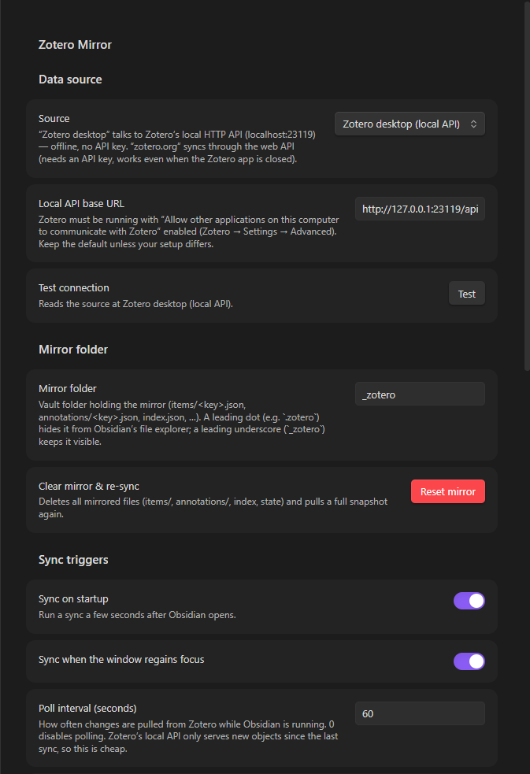
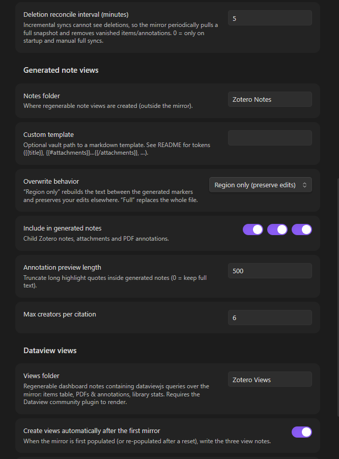
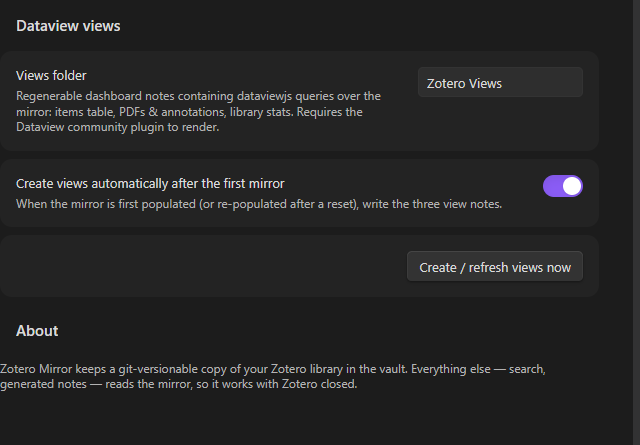

# Zotero Mirror

A different kind of Zotero plugin for Obsidian.

Instead of "importing" templated markdown snapshots on demand (static, template
bound, pull-on-demand — like other Zotero plugins), **Zotero Mirror syncs a
database**: it keeps a hidden folder inside your vault that is a live, complete,
git-versionable mirror of your Zotero library. Every other feature — search,
generated "note views", annotations, metadata — reads from that mirror, so
everything is instant and keeps working with Zotero closed.

This is the difference between *an import plugin* and *a Zotero client inside
Obsidian*.

## Screenshots

<p float="left">
  
  
</p>
<p float="left">
  
</p>

*Everything — connection to Zotero, mirror folder, sync triggers, generated
notes and Dataview dashboards — is configured from this single settings tab.*

---

## Why a mirror?

| | Import plugins (template snapshots) | Zotero Mirror |
|---|---|---|
| Data model | One markdown note per item, created on demand | Full library DB: one JSON file per Zotero item + per-PDF annotation files |
| Sync | Pull when you ask | Incremental, automatic whenever Zotero changes |
| Zotero closed | New snapshots impossible | Mirror already in the vault — everything else reads it offline |
| Git | Duplicated, drifted copies | The mirror is the source of truth; every change is a small, clean diff |
| "Notes" | Static snapshots that age | Generated *views* over the mirror, regenerable any time |

## How it works

Zotero ships a **local HTTP API** (Settings → Advanced → *"Allow other
applications on this computer to communicate with Zotero"*) that serves your
local database over `http://localhost:23119/api/` — offline, no API key. Zotero
Mirror talks to it using the same incremental protocol Zotero's own clients use:

- **Every poll** fetches only objects newer than the last seen *library version*
  (`?since=<version>`, cheap), then updates exactly the changed item files.
- **Deletion reconcile** (on a cadence, at startup, and on full syncs) pulls a
  complete snapshot and removes mirrored files whose items vanished upstream —
  deletions are invisible to incremental syncs.
- **PDF annotations** are normal Zotero items (type `annotation`, children of
  attachment items), so they arrive through the same incremental path and are
  aggregated into one file per PDF.

The plugin needs **Zotero 7+** and only runs while Obsidian is open (like every
Obsidian plugin): edits you make in Zotero are picked up on the next poll
(default every 60 s), on window focus, and on Obsidian startup. Close Obsidian
while changing Zotero → changes sync the next time Obsidian opens. A web-API
source (zotero.org, needs an API key) is also available for syncing while the
Zotero app is closed.

## The mirror folder

Everything lives in one folder (default `_zotero/`, configurable — use a
leading dot such as `.zotero` if you want Obsidian's file explorer to hide it):

```
_zotero/
├── README.md                 # created once, explains the folder
├── .state.json               # sync cursor (library version, timestamps) — only written on changes
├── collections.json          # collections (key, name, parent)
├── index.json                # regenerable search index: one lightweight summary per item
├── notes.json                # registry of generated note views (key → note path)
├── items/<itemKey>.json      # ONE FILE PER ITEM — the core of the mirror
│                             # (bibliographic items, notes, attachments AND annotations)
└── annotations/<attachmentKey>.json   # per-PDF aggregated annotation files
```

`items/<key>.json` stores the raw Zotero API record (`key`, `version`, `meta`,
`data` with creators/tags/collections/relations, …). `annotations/<key>.json`
is derived (one entry per highlight with color, page label, text, comment,
position) and regenerated whenever the PDF or its highlights change. `index.json`
and `notes.json` are derived too — you can delete them and they get rebuilt.

**Version the folder with git** and you get full history of your Zotero library
(metadata, notes, highlights) in your vault, diffable and greppable, no Zotero
needed.

### Reading the mirror from other tools

Everything is plain JSON, versioned and readable with Zotero closed:

- `_zotero/index.json` — regenerable index: one lightweight summary per item
  (`key`, `version`, `itemType`, `title`, `creators` (string), `year`, `date`,
  `parentItem`, `collections` (keys), `tags`).
- `_zotero/items/<key>.json` — full API record of one item: `data` holds
  creators/title/abstractNote/tags/collections/relations/DOI/url/…, `meta` the
  Zotero-side summary (e.g. `creatorSummary`), plus the object `version`.
- `_zotero/annotations/<attachmentKey>.json` — one per PDF attachment:
  `filename`, `contentType`, `annotations[]` with `pageLabel`, `pageIndex`,
  `color`/`colorName`, `text`, `comment`, `position`.
- `_zotero/collections.json` — `[{key, name, parentCollection, version}]`.

Dataview, Templater, scripts or your own plugins can load any of these files
and render the data as tables, cards, counts, graphs, … — that is what "a
Zotero client inside Obsidian" means: your vault data, queryable like any other.

> **Folder-name note:** keep the underscore spelling (`_zotero`, the default)
> for Dataview/tooling queries. Obsidian treats folders starting with a dot as
> hidden and does not index their files, so a leading-dot folder is only for
> people who never query the mirror and just want it out of the way.

> **Dataview API note (verified against Dataview's source):** dataviewjs has no
> `dv.io.loadJson`, and `dv.io.load` only reads files Obsidian has *indexed* —
> unreliable for mirror files. Dataview does expose `dv.app`, so read mirror
> JSON straight from disk:
>
> ```dataviewjs
> async function readJson(p) {
>   try { return JSON.parse(await dv.app.vault.adapter.read(p)); } catch { return null; }
> }
> const idx = await readJson("_zotero/index.json"); // works for any file
> ```

### Ready-made Dataview views (generated dashboards)

The easiest way to "build views with Dataview": let the plugin write them. After
the **first completed mirror** (or after a reset) it creates three dashboard
notes — or run *"Zotero Mirror: Create/refresh Dataview views"* any time:

| View note (in `Zotero Views/`) | Renders |
|---|---|
| `Zotero Items.md` | every top-level item: clickable title (opens its generated note), creators, year, type, collections, mirror-JSON link |
| `Zotero PDFs & Annotations.md` | every PDF with each highlight: page, color, text, comment |
| `Zotero Library Stats.md` | mirror snapshot, items by type, most-used tags |

The notes contain `dataviewjs` queries that read the mirror JSON live (they use
`dv.app.vault.adapter.read`, so they work even though Dataview itself doesn't
index the mirror files). They are regenerable: refreshes overwrite a file only
while it still carries its `<!-- zotero-views:generated -->` marker — delete the
marker to protect a customized copy. You can embed a dashboard anywhere with
`![[Zotero Items]]`. The generated queries also link each item to its note view
via the `notes.json` registry, so the views double as an index of your Zotero
notes.

If you prefer hand-rolled blocks, here are equivalent minimal recipes (all use
the `readJson` helper above, which also works for old Dataview builds — no
`loadJson` needed; `index.json`, `collections.json` and `annotations/*.json`
are regenerable, so experiments are safe):

#### Items overview (one file read)

```dataviewjs
const MIRROR = "_zotero"; // ← your mirror folder from the settings
async function readJson(p) { try { return JSON.parse(await dv.app.vault.adapter.read(p)); } catch { return null; } }
const idx = await readJson(MIRROR + "/index.json");
if (!idx) dv.paragraph("Mirror not synced yet — run “Zotero Mirror: Sync now”.");
else {
  const coll = {};
  for (const c of (await readJson(MIRROR + "/collections.json")) ?? []) coll[c.key] = c.name;
  const tops = idx.items.filter(i => !i.parentItem && i.itemType !== "attachment");
  dv.table(["Title", "Creators", "Year", "Type", "Collections"],
    tops.map(i => [i.title ?? "(untitled)", i.creators ?? "", i.year ?? "",
                   i.itemType, i.collections.map(k => coll[k] ?? k).join(", ")]));
}
```

#### PDFs and their annotations (one read per attachment)

```dataviewjs
const MIRROR = "_zotero";
async function readJson(p) { try { return JSON.parse(await dv.app.vault.adapter.read(p)); } catch { return null; } }
const idx = await readJson(MIRROR + "/index.json");
const rows = [];
for (const pdf of (idx?.items ?? []).filter(i => i.itemType === "attachment")) {
  const list = (await readJson(MIRROR + "/annotations/" + pdf.key + ".json"))?.annotations ?? [];
  if (!list.length) rows.push([pdf.title ?? pdf.key, "", "", "— no highlights —", ""]);
  for (const a of list) rows.push([pdf.title ?? pdf.key, a.pageLabel ?? "", a.colorName ?? a.color ?? "", a.text, a.comment ?? ""]);
}
dv.table(["PDF", "Page", "Color", "Highlight", "Comment"], rows);
```

#### Full detail for one item, from the current note's frontmatter

```dataviewjs
const MIRROR = "_zotero";
async function readJson(p) { try { return JSON.parse(await dv.app.vault.adapter.read(p)); } catch { return null; } }
const key = dv.current().zotero-key;
if (!key) dv.paragraph("This note has no `zotero-key`.");
else {
  const rec = await readJson(MIRROR + "/items/" + key + ".json");
  dv.header(3, rec.data.title ?? key);
  dv.list([
    (rec.data.creators ?? []).map(c => c.name ?? ((c.firstName ?? "") + " " + (c.lastName ?? "")).trim()).filter(Boolean).join("; "),
    "Type: " + rec.data.itemType + " · Year: " + (rec.data.date ?? ""),
    rec.data.abstractNote ? "**Abstract:** " + rec.data.abstractNote.replace(/<[^>]+>/g, "") : null,
    "Tags: " + (rec.data.tags ?? []).map(t => t.tag ?? t).join(", "),
  ].filter(Boolean));
}
```

Need the data as *prose*, not a table? Use the plugin's generated note views:
*"Open generated note for a Zotero item"* renders any item (metadata + child
notes + per-PDF highlights) from the same mirror files, and *"Open a Zotero
item's mirror JSON file"* opens the raw record in the editor.

## Commands

| Command | What it does |
|---|---|
| **Sync Zotero mirror now** | Incremental pull of everything changed since last sync |
| **Full sync & reconcile mirror** | Re-pulls everything and removes mirrored files deleted in Zotero |
| **Search Zotero items and insert reference card** | Fuzzy search over the mirror → inserts a reference blockquote into the active note |
| **Open generated note for a Zotero item** | Picks an item → opens its note view, generating it first if needed |
| **Open a Zotero item in the Zotero app** | Picks an item → `zotero://` URI |
| **Open a Zotero item's mirror JSON file** | Browse the raw mirrored record |
| **Refresh note for the Zotero item in the active document** | Rebuilds the generated view for the note you're reading (`zotero-key` in frontmatter) |
| **Refresh all generated Zotero notes from the mirror** | Rebuilds every generated note that still has its markers |
| **Create generated notes for every top-level item** | One note view per bibliographic item (existing ones refreshed) |
| **Create/refresh Dataview views** | Writes the three Dataview dashboard notes (Items, PDFs & annotations, Stats) into the views folder |

The ribbon button and the status bar item ("Zotero: synced … (N)") trigger a
sync; right-click the status bar for a menu. The status bar shows mirror size
and the last sync time, and turns red/grey when Zotero is unreachable or
misconfigured.

**Syncs always confirm completion.** Anything you trigger (command, ribbon,
status bar) shows a notice even when nothing changed — e.g.
*"Up to date. Mirror: 98 items (45 PDFs, 0 annotations)."* Automatic syncs
(startup, poll, window focus) are quieter: they announce the first completed
mirror, applied changes, and errors, so you never wonder whether the database
was mirrored.

## Generated note views

Notes are pure **views over the mirror**: rendering reads only `_zotero/items`,
never Zotero, so regeneration works offline and after any sync. A generated
note looks like:

```
---
zotero-key: ABC123DE
zotero-mirror: true
zotero-item-type: journalArticle
title: "…"
updated: "2026-…"
tags:
  - "methods"
---

[ your own preamble — survives regeneration ]

<!-- zotero-mirror:start -->
# Title
> [!info]- Item
> **Author, A.** · journalArticle, *Journal*…
…
<!-- zotero-mirror:end -->

[ your own notes after the block — also survives ]
```

Default behavior (Overwrite: **region only**) rebuilds *only* the text between
the markers and updates only the frontmatter keys the plugin manages
(`zotero-key`, `zotero-mirror`, `zotero-item-type`, `title`, `updated`, `tags`).
Everything else is yours. "Full" overwrite mode exists for people who treat the
notes as 100% generated.

### Custom templates

Set *Settings → Generated note views → Custom template* to any markdown file in
the vault. The template renders the **body only** (frontmatter is managed).

| Token | Meaning |
|---|---|
| `{{key}}`, `{{title}}`, `{{year}}`, `{{date}}` | item key, title, year, date |
| `{{creators}}`, `{{creatorList}}`, `{{creatorsShort}}` | creators (Last, First / First Last / truncated) |
| `{{itemTypeLabel}}`, `{{publicationTitle}}`, `{{abstract}}` | type, venue, abstract (HTML stripped) |
| `{{doi}}`, `{{url}}`, `{{collections}}`, `{{tags}}`, `{{citation}}` | fields, collection names, tags, offline citation |
| `{{zoteroLink}}`, `{{mirrorLink}}` | "Open in Zotero" and mirror-JSON links |
| `{{#metaRows}}\| {{field}} \| {{value}} \|{{/metaRows}}` | metadata table rows |
| `{{#childNotes}}…{{/childNotes}}` | child Zotero notes (`{{content}}`) |
| `{{#attachments}}…{{/attachments}}` | per attachment (`{{filename}}`, `{{contentType}}`, `{{attachmentLink}}`) |
| `{{#annotations}}…{{/annotations}}` | inside attachments: highlights (`{{colorName}}`, `{{colorEmoji}}`, `{{pageLabel}}`, `{{text}}`, `{{comment}}`) |
| `{{?list}}…{{/list}}` | render the block once if the list is non-empty |

## Settings

- **Source** — *Zotero desktop (local API)* or *zotero.org (Web API)*; local base
  URL / user id / API key, plus a **Test connection** button.
- **Mirror folder** — where the mirror lives; **Reset mirror** wipes it and does
  a full re-sync (generated notes are never touched).
- **Sync triggers** — on startup, on window focus, poll interval (0 = off),
  deletion-reconcile interval.
- **Generated note views** — notes folder, custom template, overwrite mode,
  what to include (child notes / attachments / annotations), annotation preview
  length, creators per citation.
- **Dataview views** — folder for the generated dashboard notes, auto-create
  them after the first mirror, and a *Create/refresh views now* button
  (requires the Dataview community plugin).

## Install (development build)

1. `npm install && npm run build` in this folder.
2. Copy the folder (or symlink it) into `<vault>/.obsidian/plugins/zotero-mirror/`
   and enable **Zotero Mirror** in Settings → Community plugins.
3. In Zotero: Settings → Advanced → tick *"Allow other applications on this
   computer to communicate with Zotero"* (Zotero 7+), then run
   *Zotero Mirror: Sync now*.

## Troubleshooting

- **"Test connection" fails with ERR_EMPTY_RESPONSE / "requestUrl failed"** —
  Zotero's local server is a minimal HTTP/1.0 server that *closes connections
  carrying browser-style headers* (e.g. `Accept-Encoding: gzip, deflate, br`,
  browser `User-Agent`, `Origin`, `Sec-Fetch-*`), which is exactly what
  Obsidian's `requestUrl` (Electron/Chromium) sends. Zotero Mirror therefore
  talks to the local API with a plain Node `http` request and a minimal header
  set, and only falls back to `requestUrl` (used for the HTTPS web API). If
  the test still fails: Zotero silently switches to a different port when
  23119 is occupied, or the *Allow other applications…* preference is off.
- **"Zotero refused the request (403)"** — enable the *Allow other
  applications…* preference in Zotero, then Test connection.
- **Status bar shows "Zotero: offline"** — Zotero isn't running or the local API
  preference is off. The mirror still serves search/notes.
- **Changes only appear while Obsidian is open** — that's inherent to Obsidian
  plugins; edits sync on the next poll/focus/startup.
- **Items in the Zotero Trash aren't mirrored** — the API excludes trashed
  items; this mirrors your *library*.
- **Never-synced/offline-only Zotero items (version 0)** — full snapshots and
  reconciles cover these (version maps list every key).
- **The mirror folder looks stale in the file explorer** — mirror files are
  written straight to disk (fast, no note indexing). Restart Obsidian or
  collapse/reopen the folder if needed; git and other tools always see the
  current files. A leading-dot folder avoids explorer clutter entirely.
- **Generated note has no markers / won't refresh** — marker-based refresh is
  intentionally conservative: it never silently deletes your edits. Switch
  overwrite to *full* to replace such a file.

## Roadmap

- Group libraries, better-bibtex citekeys, live citation rendering (CSL via
  Zotero's formatter, cached in the mirror), watch-the-Zotero-log event sync,
  mobile web-API sync, YAML storage option, mirror browser pane.

## License

MIT © 2026 Kerekes Stefan
